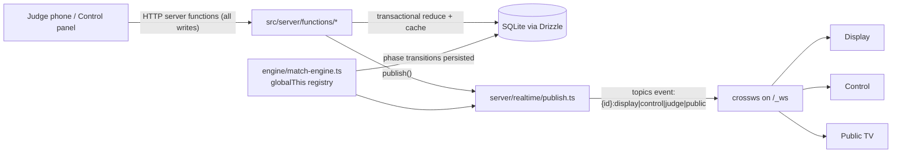
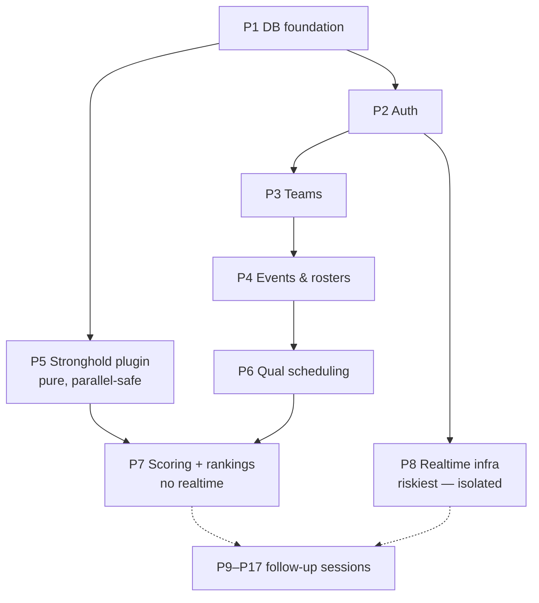

# MiniSystem — Build Plan (refined; this session implements P1–P8)

## Context

Rewrite the Electron app **Custom-MiniFRC-FMS** (MiniFRC field management system: jQuery, two Electron windows, JSON-file DB) as **MiniSystem**, a modern full-stack web app in this repo's fresh TanStack Start scaffold. New capabilities: auth (admins + team logins), multi-event management, auto qual scheduling, alliance selection, double-elim playoffs, mobile judge scoring with realtime sync, animated display screen, team stats, public/TV pages.

**Decisions locked with user:** cloud VPS hosting (HTTPS) · WebSockets · hand-rolled session auth · Drizzle ORM + better-sqlite3 · Motion for animations · npm.

**This session's scope (per user):** implement **P1–P8** (DB → auth → teams → events → Stronghold plugin → qual scheduling → scoring/rankings → realtime infra) in one PR. P9–P17 are the roadmap for follow-up sessions.

**Reference source (per user):** the user will add Custom-MiniFRC-FMS to this environment before implementation (expect it at `reference/` or similar — locate it at start). **Confirm it exists before starting P5**; if it's absent, implement from the inline spec below (it is complete) and note that in the PR. The repo is the user's private fork of AlfredoSystems/MiniFRC-Deep-Space-FMS — hence the Deep Space leftovers noted in bugs.

## Verified repo facts (grounding)

- Fresh TanStack Start scaffold only: `src/routes/{__root.tsx,index.tsx}`, `src/router.tsx`, `src/components/ui/button.tsx`, `src/lib/utils.ts`, `src/styles.css` (Tailwind v4 CSS-first, shadcn radix-lyra style, `@/*` alias).
- `package.json` declares `@tanstack/*` as `latest`; lockfile pins: react-start **1.168.25**, react-router **1.170.15**, router-plugin **1.168.18**, react-router-ssr-query **1.167.1**, react-router-devtools **1.167.0**, react-devtools **0.10.5**, devtools-vite **0.7.0**, eslint-config **0.4.0**. **P1 pins these exact versions in package.json** (de-risks P8).
- Start 1.168.25 runs on **srvx 0.11.16 + h3-v2** (verified in lockfile; no Nitro/Vinxi). h3-v2 declares an **optional peer `crossws ^0.4.1`** — so install `crossws@^0.4.1`, and the WS plan (attach a crossws Node adapter to the HTTP server `upgrade` event) is compatible.
- `zod@4.4.3` and `nanoid@3.3.12` exist only transitively — add as direct deps; **use zod v4 API**.
- `@tanstack/react-router-ssr-query` is installed but **not wired** in `src/router.tsx`; `@tanstack/react-query` is not installed. P1 adds it and wires `setupRouterSsrQueryIntegration`.
- Vitest 4 + jsdom + testing-library installed, **no vitest config** — P1 adds one with two projects (node env for `src/{server,games,db}`, jsdom for components).
- npm is the package manager (npm lockfile present; ignore `.cta.json`'s `pnpm`).
- `.gitignore` lacks `data/` (SQLite dir) — add in P1. `public/manifest.json` is scaffold default (replaced in P16).
- No `tsx`/script runner — add `tsx` devDep for `scripts/*.ts` (seed, etc.).

## Architecture

### Realtime write path (the shape everything hangs on)

WS is **read-mostly**: clients never write over the socket. All publishing goes through `src/server/realtime/publish.ts`; all client subscription through `useRealtime(topics, onMessage)` — single seam to swap to SSE if crossws fights back.

### Schema (`src/db/schema.ts`, text nanoid PKs, JSON columns via `text({mode:"json"})` + zod)

- `users` (role 'admin'|'team', username unique — team users use two-digit team-number string, scrypt passwordHash, teamId?) · `sessions` (sha256 of token, expiry)
- `teams` (number unique, name) — global, reused across events · `participants` (teamId, name — display only)
- `events` (name, slug, gameId='stronghold2016', status setup|quals|alliance_selection|playoffs|complete, currentMatchId?, displayView, settings JSON) · `event_teams` (eventId+teamId unique, selectionStatus available|captain|picked|declined|backup)
- `matches` (eventId, type qualification|playoff, number, set, bracketSlot?, redSource/blueSource? e.g. 'seed:1'|'winner:UB-R1-M1', red1..3/blue1..3 teamIds?, red/blueAllianceId?, status scheduled|running|scored|posted, scheduledOrder, startedAt?, redScore/blueScore JSON cached aggregates, red/bluePoints, red/blueRP, winner?, surrogates/disqualifications JSON)
- `score_events` (matchId, alliance, type, payload JSON {robotIndex?, defenseIndex?…}, **matchTimeMs server-computed from startedAt — never trust client clocks**, createdBy, undone) — event-sourcing; aggregates cached on `matches` via the plugin reducer
- `alliances` (eventId, number 1..N, captain/pick1/pick2/backupTeamId) · `selection_actions` (append-only invite|accept|decline|undo log; server reduces to live selection state — restart-safe)
- **No rankings table** (computed on demand, tiny N; client-cached by TanStack Query). **No bracket table** (code templates per alliance count generate matches with bracketSlot/sources; advancement fills dependents when a match posts).

### Realtime details

- `src/server/engine/match-engine.ts` (P9): server-authoritative state machine, setTimeout phase chain from plugin timing, every transition persisted → recoverable after restart/HMR. Singletons live on a `globalThis` registry (`src/server/engine/registry.ts`, built in P8) to survive dev module duplication.
- crossws on `/_ws`; session cookie validated in upgrade hook. Topics `event:{id}:display|control|judge|public` with ACL.
- Messages: zod discriminated unions in `src/shared/realtime-messages.ts` — `match_state` (phase + absolute `phaseEndsAt` + `serverNow`), `score_update`, `view_change`, `toast`, `selection_update`, `bracket_update`, `sound`, `pong`.
- **Timer sync:** no ticks. Clients receive absolute deadlines; `useServerClock()` computes offset via median of 5 ping/pongs; countdown rendered locally via rAF.

### Routes (`src/routes/`)

`index` (landing) · `login` · `public/$eventSlug/{index,tv}` (no auth) · `display/$eventId` (chromeless, WS-driven) · `judge/$eventId` (mobile scorer) · `admin/route` (guard) + `admin/{index,teams}`, `admin/events/index`, `admin/events/$eventId/{index,matches,control,rankings}` · `team/route` (guard) + `team/index`. Chromeless routes opt out of the nav shell via route context flag in `__root.tsx`.

### Game plugin (`src/games/`)

`types.ts` defines `GameDefinition`: timing phases + sound cues, scoreEventTypes (zod schemas — these drive the judge UI), `initialScore()`, pure `reduce(score, event)`, `computeTotals`, `computeRP`, rankingComparators, judgeLayout metadata, display widget components. `stronghold/` is the only implementation; registry in `games/index.ts` keyed by `events.gameId`. Generic code never names game concepts. No dynamic loading — just clean boundaries.

### Stronghold spec (inline source of truth; cross-check against `reference/` `src/renderer/match.js` + `controller.js` when porting)

- PointValues: REACH 2, AUTO_CROSS 10, AUTO_LOW_GOAL 5, AUTO_HIGH_GOAL 10, CROSS 5, LOW_GOAL 2, HIGH_GOAL 5, CHALLENGE 5, SCALE 15, PLAYOFF_BREACH 20, PLAYOFF_CAPTURE 25, FOUL 5, TECH_FOUL 5. Tower strength 6. Breach = ≥4 of 5 defenses at strength 0. Capture = opponent tower ≤ 0 (6 − goals + ownTechFouls) AND all 3 robots endgame ≠ 0.
- Phases: NO_ENTRY → SAFE_TO_ENTER → READY → AUTO (0–15s) → TELEOP (15–120s) → ENDGAME (120–150s) → over; field fault; replay clears scores.
- Rankings: RP (2 win / 1 tie) ÷ matchesPlayed; tiebreak auto → endgame → boulder; surrogates excluded.
- Assets: `/sounds/*.wav` (6 cues), `/images/*.png` — copy from reference repo when present.
- **Known source bugs — fix, don't port:** inverted foul colors (control-window-renderer.js:99, user-input.js:76-84 — a foul on an alliance must credit the **opponent**; explicit test for this), Deep Space leftover fields in team.js rankings, `cargoPoints` typo in controller.js:210.

## Phase dependencies

## This session: P1–P8

**P1 — DB foundation + scaffold hardening.** Pin `@tanstack/*` to the lockfile versions above. Deps: `drizzle-orm better-sqlite3 zod nanoid @tanstack/react-query` (+dev `drizzle-kit @types/better-sqlite3 tsx`). Wire `setupRouterSsrQueryIntegration` in `src/router.tsx`. `src/db/{schema,index}.ts`, `drizzle.config.ts` (dialect sqlite, `DATABASE_PATH` env, default `data/minisystem.db`), scripts `db:generate/db:migrate/db:seed`. Add `vitest.config.ts` (node project for `src/{server,games,db}/**/*.test.ts`, jsdom for the rest). Add `data/` to `.gitignore`. ✓ migrate creates the DB; `npm run typecheck`; Vitest in-memory insert/read.

**P2 — Auth.** `src/server/auth/{password,session,middleware}.ts` (scrypt + timingSafeEqual; httpOnly/secure/lax cookie; store sha256 of token), `src/server/functions/auth.ts`, `routes/login.tsx`, admin/team route guards, `scripts/seed-admin.ts`. shadcn (CLI already a devDep): input card form label sonner. ✓ admin logs in → /admin; team user rejected from /admin; logout; password unit tests.

**P3 — Global teams.** `src/server/functions/teams.ts`, `routes/admin/teams.tsx`: team CRUD, participants, one-click team-account provisioning. shadcn: table dialog dropdown-menu badge. ✓ create team 42, provision, log in as "42".

**P4 — Events & rosters.** `src/server/functions/events.ts`, `routes/admin/events/{index,$eventId/index}.tsx`: create event, attach new teams or import roster from a prior event, status lifecycle. ✓ Event B imports Event A's 15 teams.

**P5 — Stronghold plugin (pure; can interleave with P3/P4).** `src/games/types.ts`, `src/games/stronghold/index.ts` + `scoring.test.ts`, `src/shared/score-types.ts`. Port match.js semantics exactly per the inline spec (read `reference/` if present); fix the foul-color + Deep Space bugs. ✓ ~20 scenario tests incl. reducer round-trips and the foul-credits-opponent test.

**P6 — Qual scheduling.** `src/server/scheduling/matchmaker.ts` (TS replacement for MatchMaker.exe: configurable rounds/team, no team twice per match, minimize partner/opponent repeats + back-to-backs via randomized swaps, surrogates when teams×rounds % 6 ≠ 0), `src/server/functions/matches.ts`, `routes/admin/events/$eventId/matches.tsx`. ✓ constraint tests for 9/15/24 teams; regenerate allowed only while status='setup'.

**P7 — Scoring pipeline + rankings (vertical slice, no realtime).** `src/server/functions/scoring.ts` (recordScoreEvent/undo/postMatch — transactional reduce + cache on `matches`), `src/server/functions/rankings.ts`, `routes/admin/events/$eventId/rankings.tsx`, manual score-entry dialog. ✓ two hand-entered matches rank correctly vs hand computation; undo recomputes; surrogate-exclusion test.

**P8 — Realtime infra (riskiest — timebox ~1 day, pivot internals to SSE behind the same `publish`/`useRealtime` seam if blocked).** Dep `crossws@^0.4.1`. `src/server/realtime/{ws,publish}.ts`, `src/server/engine/registry.ts` (globalThis), Vite dev plugin (`configureServer` → httpServer `upgrade` → `/_ws`), `server/index.mjs` prod entry wrapping the built fetch handler (+ upgrade) — verify the actual `vite build` output layout at implementation time, `src/hooks/{use-realtime,use-server-clock}.ts`, `src/shared/realtime-messages.ts`, throwaway WS debug panel route. ✓ two tabs receive a publish in dev **and** in `npm run build && node server/index.mjs`; clock offset stable ±25 ms; session cookie required on upgrade.

**Session close-out:** `npm test` + `npm run typecheck` green; commit on a branch; push; open PR (P1–P8 foundation).

## Roadmap (follow-up sessions; spec retained so later sessions can execute)

**P9 — Match engine + phase controls.** `src/server/engine/match-engine.ts` (+ fake-timer tests), `src/server/functions/field-control.ts` (setCurrentMatch/noEntry/safeToEnter/playMatch/fieldFault/replay), `routes/admin/events/$eventId/control.tsx` v1 (phase buttons, read-only live points). ✓ broadcasts AUTO/TELEOP/ENDGAME/POST at 0/15/120/150 s (shortened config in tests); replay clears events; engine survives dev-server restart mid-match.

**P10 — Judge mobile scorer.** `routes/judge/$eventId.tsx`, `src/components/judge/scoring-pad.tsx`, judgeLayout in plugin: alliance select → plugin-driven buttons (goals, per-defense damage, per-robot auto/endgame, fouls), undo, synced timer header. ✓ score from a phone during a live match; matchTimeMs sane; control panel updates live.

**P11 — Display screen v1 + sounds + preview.** `--alliance-red`/`--alliance-blue` tokens in `src/styles.css` (Tailwind v4: values in `:root`, mapped in `@theme inline`). `routes/display/$eventId.tsx`, `src/components/display/{wings,timer-bar,scoreboard,camera-feed,views/*}.tsx` (clip-path wings — detailed design comes later from user), camera via getUserMedia 1920×1080, plugin display widgets (towers/defenses/goals/breach/capture), match/results/rankings/intermission/camera views, No Entry persistent toast + Safe to Enter timed toast, WAV cues from reference repo → `public/sounds/` behind a click-to-arm audio gate (autoplay policy). `src/server/functions/display.ts` (setView persists + publishes). Control panel: scaled-iframe live preview + view buttons. ✓ full simulated match: sounds at boundaries, live scores, view switching.

**P12 — Alliance selection.** N = floor(teams/3); captains = top N; snake 1→N→1; invite→accept/decline (decline = permanently ineligible; a captain accepting another's invite triggers captain backfill from next-ranked); after all 3/3, next N ranked = backups. `src/server/selection/state-machine.ts` (reduce `selection_actions`; tests for backfill/snake/decline), `src/server/functions/selection.ts`, selection display view, control-panel card, team-dashboard accept/decline (admin can act on behalf). ✓ scripted 15-team scenario incl. captain-accepts-invite backfill; survives restart.

**P13 — Double-elim playoffs + bracket.** `src/server/playoffs/templates.ts` (explicit hand-built templates per alliance count: 8 = standard FRC double-elim; 4/5/6/7 with byes — no canonical source, unit-test each), `advance.ts` (posting fills winner:/loser: dependents + team columns from alliance rosters) + tests, `functions/playoffs.ts`, `src/components/bracket/bracket-graphic.tsx` (SVG/grid), bracket display view, queueing in control panel. ✓ simulate 5- and 8-alliance playoffs to a champion in tests; live bracket updates.

**P14 — Team dashboard.** shadcn charts (recharts). `src/server/functions/team-stats.ts`, `routes/team/index.tsx`, radar chart (auto/boulders/defenses/endgame/penalty-avoidance — alliance-level, labeled as such), schedule + results, alliance invite status. ✓ numbers cross-check against match list.

**P15 — Public + TV mode.** `routes/public/$eventSlug/{index,tv}.tsx` reusing rankings/bracket components; TV rotates rankings → current/next match → bracket → event info via `event:{id}:public`. ✓ logged-out live data; 10-min unattended rotation without WS leaks.

**P16 — Motion + PWA + nav shell.** `motion` dep: contextual display transitions (red win → red sweep, blue → blue, neutral otherwise, keyed off last `match_state` winner), animated score tick-ups, timer color morphs, bracket/selection reveals (`src/components/display/transitions.tsx`, `animated-number.tsx`). `vite-plugin-pwa` (replace scaffold `public/manifest.json`, icons from reference `/images`, offline shell for judge page). `src/components/nav/app-shell.tsx` with an apps-registry array for future top-level modules. ✓ visual pass; PWA installs on a phone.

**P17 — Deployment.** VPS (not serverless — SQLite + WS + long-lived engine need a persistent process/disk). Caddy (auto-HTTPS — required for getUserMedia/PWA/secure cookies) proxying `/_ws` upgrades; systemd unit for `node server/index.mjs`; `DATABASE_PATH` on a persistent volume; nightly backup (Litestream or cron `.backup`); deploy script runs migrations. ✓ internet dry-run: phone judge + TV + control laptop simultaneously; reboot mid-event and recover.

## Risks

1. **WS on srvx/h3-v2** — no official Start API; P8 isolates it behind `publish`/`useRealtime` with an SSE escape hatch; `@tanstack/*` pinned in P1; crossws must stay on `^0.4.x` (h3-v2 peer range).
2. **Dev HMR singleton duplication** — globalThis registry + DB-recoverable engine/selection state.
3. **better-sqlite3 native build** — compiles on install; if the container lacks toolchain, fall back to checking in a prebuilt or using `node:sqlite`. Verify in P1 immediately.
4. **SQLite on ephemeral filesystems** — VPS/volume only; backups from day one (P17).
5. **getUserMedia + audio autoplay** — HTTPS + one-click "arm display" gesture gate (P11).
6. **Non-8-alliance double-elim has no canonical template** — hand-design + unit-test each count (P13).
7. **Client clocks untrustworthy** — matchTimeMs computed server-side from `startedAt`.

## Verification

- Every phase boundary: `npm test` + `npm run typecheck` green.
- P8 gate (end of this session): two browser tabs receive a published message over `/_ws` in dev **and** in the production build (`npm run build && node server/index.mjs`); unauthenticated upgrade rejected; clock-offset hook stable.
- Data gate (end of this session): seed admin → create teams → create event → import roster → generate quals for 15 teams (constraints hold) → hand-enter two match scores → rankings match hand computation; foul-credits-opponent test passes.
- Full-event E2E (after P11 and again after P17, later sessions): seed teams → event → quals → phone judges score 2–3 live matches → rankings → alliance selection with a decline + captain backfill → 5-alliance playoffs to a champion, with display + control + public TV on three screens.
